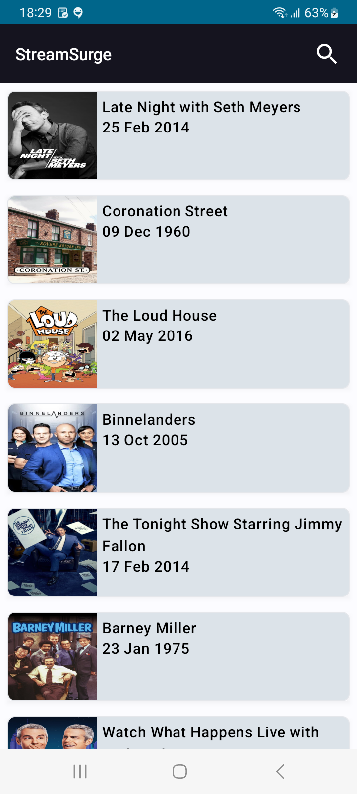
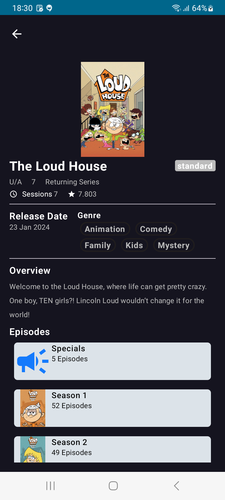

## Introduction

My Awesome Android App is a sample application built with Jetpack Compose, Room Database, Koin DI, and offline data handling. The app demonstrates best practices for developing modern Android applications.
## Features

- Jetpack Compose UI
- Room Database for local storage
- Koin Dependency Injection
- Offline data handling
- ...
## Screenshots

## Dependencies

- Jetpack Compose
- Room Database
- Koin DI
- ...
## Contributing

1. Fork the project
2. Create a new branch (`git checkout -b feature/new-feature`)
3. Commit your changes (`git commit -m 'Add new feature'`)
4. Push to the branch (`git push origin feature/new-feature`)
5. Open a pull request
